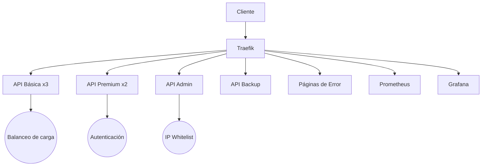

# 🚀 Implementación de Traefik con Ruteadores, Servicios y Middlewares

## 📋 Descripción del Proyecto
Este proyecto implementa un entorno completo con **Traefik** como reverse proxy/load balancer, gestionando múltiples servicios API con autenticación, balanceo de carga, manejo de errores y monitoreo.

## 🌟 Características Principales
- **Balanceo de carga** entre 3 instancias de API básica
- **Autenticación básica** para API premium
- **Control de acceso por IP** para API admin
- **Servidor de respaldo** automático para errores 500
- **Páginas de error personalizadas**
- **Monitoreo** con Prometheus + Grafana

## ⚠️ Compatibilidad
✅ **Navegadores probados:**  
- Brave (funciona perfectamente)
- Opera (funciona perfectamente)  
❌ **Firefox:** Actualmente presenta problemas con las URLs locales (.localhost)

## 🛠 Instalación

### 1. Clonar el repositorio
```bash
git clone https://github.com/julianReyes-dev/traefik-taller-marzo-30.git
cd traefik-taller-marzo-30
```

### 2. Iniciar los servicios
```bash
docker-compose up -d --build
```

### 3. Verificar contenedores
```bash
docker-compose ps
```

## 🌐 Acceso a los Servicios
| Servicio | URL | Credenciales (si aplica) |
|----------|-----|--------------------------|
| Traefik Dashboard | http://traefik.localhost | - |
| API Básica | http://api.localhost/basic | - |
| API Premium | http://api.localhost/premium | user:user |
| API Admin | http://api.localhost/admin | admin:secret |
| Prometheus | http://monitor.localhost | - |
| Grafana | http://grafana.localhost | admin:admin (primera vez) |

## 🔍 Pruebas de Funcionalidad

### 1. Balanceo de carga (API Básica)
```bash
for i in {1..10}; do curl http://api.localhost/basic; done
```
Verás respuestas de diferentes contenedores. 


De la misma forma accediendo desde http://api.localhost/basic cada vez que se recargue la página se verá un contenedor diferente (3 posibles, tenga en cuenta que hay un error simulado por tanto si le sale el mensaje ⚠️ SERVIDOR DE RESPALDO ACTIVADO por favor ignorelo por ahora).  


### 2. Simular alta carga/errores
```bash
curl -H "X-Force-Fail: true" http://api.localhost/basic
```
Deberías ver la respuesta del servidor de respaldo.  


De la misma forma en el navegador ingresando a http://api.localhost/basic al recargar la página hay un error simulado con 30% de probabilidad en /api_basic/server.js que envía un error 500.  


### 3. Probar autenticación
Accediendo a http://api.localhost/premium desde el navegador verá el siguiente mensaje:

Ingrese las credenciales user/user y podrá acceder al servicio:

Note que si recarga la pagina verá otro contenedor, esto debido a que también está utilizando balanceo de carga pero con 2 servidores.


Igualmente utilizando el comando curl:  
```bash
# Sin credenciales (debe fallar)
curl http://api.localhost/premium
```


```bash
# Con credenciales
curl -u user:user http://api.localhost/premium
```


### 4. Probar páginas de error personalizadas
Si ingresa a una url invalida verá lo siguiente:

Igualmente si detiene un servicio y trata de ingresar a él verá lo mismo:
```bash
docker-compose stop api_basic
```


### 5. Probar acceso con IP
Ingrese desde el navegador a http://api.localhost/admin y verá

Ingrese las credenciales admin/secret y tendrá acceso

Como puede ver su IP está en el rango 172.18.0.0 dado a que pertenece a la red de docker y no es su IP real, se dejó así con fines de pruebas y para evitar la necesidad de cambiar la IP en el código.  

De la misma forma se puede probar en la terminal
```bash
# Desde tu máquina local (debería funcionar)
curl -u admin:secret http://api.localhost/admin
```


### 6. Probar el monitoreo
Ingrese a http://monitor.localhost/targets y verá:


## 🏗 Estructura del Proyecto
```
.
├── api_admin/            # API con acceso restringido por IP
├── api_basic/            # API con balanceo de carga (3 instancias)
├── api_backup/           # Servidor de respaldo
├── api_premium/          # API con autenticación básica
├── error_pages/          # Páginas de error personalizadas
├── nginx/                # Configuración de Nginx para errores
├── docker-compose.yml    # Definición de todos los servicios
├── traefik.yml           # Configuración central de Traefik
└── prometheus.yml        # Configuración de monitoreo
```

## 🤔 Preguntas de Evaluación

### 1. ¿Cómo detecta Traefik los servicios configurados en Docker Compose?
Traefik se integra con Docker a través del socket (`/var/run/docker.sock`) y lee las etiquetas (`labels`) definidas en cada servicio. Las etiquetas como `traefik.enable=true` y las reglas de ruteo permiten a Traefik descubrir y configurar automáticamente los routers y servicios.

### 2. ¿Qué rol juegan los middlewares en la seguridad y gestión del tráfico?
Los middlewares modifican las solicitudes/respuestas entre el cliente y el servicio. En este proyecto:
- `premium-auth`: Implementa autenticación básica
- `admin-ipwhitelist`: Restringe acceso por IP
- `api-500`: Maneja redirección ante errores 500
- `error-pages-middleware`: Muestra páginas personalizadas para errores

### 3. ¿Cómo se define un router en Traefik y qué parámetros son esenciales?
Un router se define con:
- **Entrypoint**: Punto de entrada (ej: `webinsecure`)
- **Rule**: Regla de coincidencia (ej: `Host(`api.localhost`)`)
- **Service**: Servicio destino
- **Middlewares**: Cadena de middlewares a aplicar

Ejemplo:
```yaml
traefik.http.routers.api-basic.rule=Host(`api.localhost`) && PathPrefix(`/basic`)
```

### 4. ¿Cuál es la diferencia entre un router y un servicio en Traefik?
- **Router**: Decide cómo se manejan las solicitudes entrantes (reglas de enrutamiento).
- **Servicio**: Define dónde se envía el tráfico (backend real como contenedores Docker).

### 5. ¿Cómo se pueden agregar más reglas de enrutamiento para diferentes rutas?
Mediante operadores lógicos en las reglas:
```yaml
# Ejemplo combinando múltiples condiciones
traefik.http.routers.my-router.rule=Host(`api.localhost`) && (PathPrefix(`/v1`) || Headers(`Content-Type`, `application/json`))
```

## 📊 Diagrama de Arquitectura


---

**Integrantes del equipo**:
- Tomas Fernando Useche Escobar
- Julian Camilo Reyes Uribe
